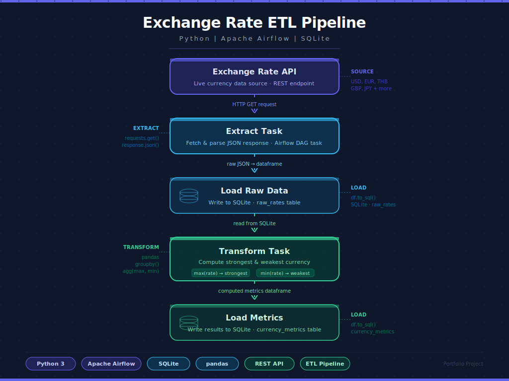

# 🚀 Airflow Financial Data Pipeline

## 📌 Overview
This project is an end-to-end data pipeline built using Apache Airflow that ingests real-time exchange rate data from an external API, processes it, and stores analytical results in a database.

The pipeline demonstrates core data engineering concepts including orchestration, data ingestion, transformation, and storage.

---

## 🏗️ Architecture



     
---

## ⚙️ Tech Stack

- **Orchestration:** Apache Airflow  
- **Language:** Python  
- **Data Source:** Exchange Rate API  
- **Storage:** SQLite  
- **Containerization:** Docker  

---

## 🔄 Pipeline Flow

1. **Extract**
   - Fetch exchange rate data from API
   - Convert to structured format

2. **Load (Raw)**
   - Store exchange rates in `exchange_rates` table

3. **Transform**
   - Identify strongest and weakest currencies

4. **Load (Metrics)**
   - Store results in `currency_metrics` table

---

## 📊 Example Output

| date       | strongest_currency | strongest_rate | weakest_currency | weakest_rate |
|------------|------------------|---------------|------------------|-------------|
| 2026-04-03 | ARS              | 1387.72       | USD              | 1.0         |

---

## 🚀 How to Run

### 1. Start Airflow

```bash
docker-compose up

### 2. Open Airflow UI

http://localhost:8080
Login:
username: admin  
password: admin

### 3. Trigger DAG
DAG name: finance_pipeline
Click Trigger

---
### SQL Queries
SELECT * FROM exchange_rates;
SELECT * FROM currency_metrics;
